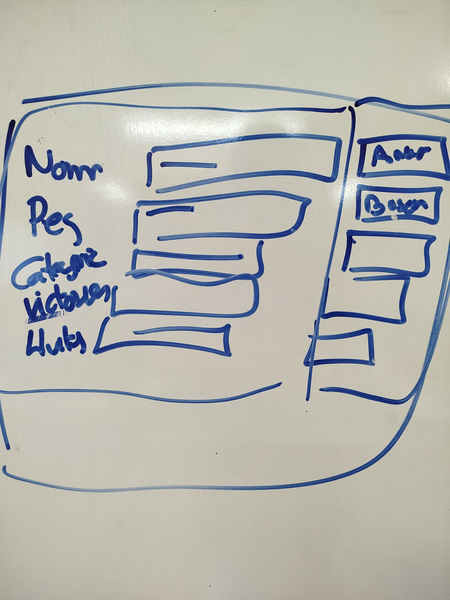

# Realitzar una pantalla per poder introduir totes les dades de lluitador del examen

En aquesta pantalla s'ha de poder ficar les dades de tot el lluitador en diferents JtextField, i a més a la dreta hi ha d'haver-hi tants botons com opcións hi hagi de menú del examen. La imatge es cutre, pero el de la dreta son botons.

Te que funcionar de manera similar al codi fet a classe.

No cal que hi hagi dos jpanel obligatoriament, sino que si ho veieu que ho podeu fer amb un n sol pues ho podeu fer, o amb dos.

El codi te que ser vostre, si hi ha coses rares, no explicades a classe, sera un 0.

Es un 0,25 pts de la nota d'examen. el examen valdrà 9,75

És te que entregar abans del dilluns a les 9 del matí, **NO DIMARTS**

